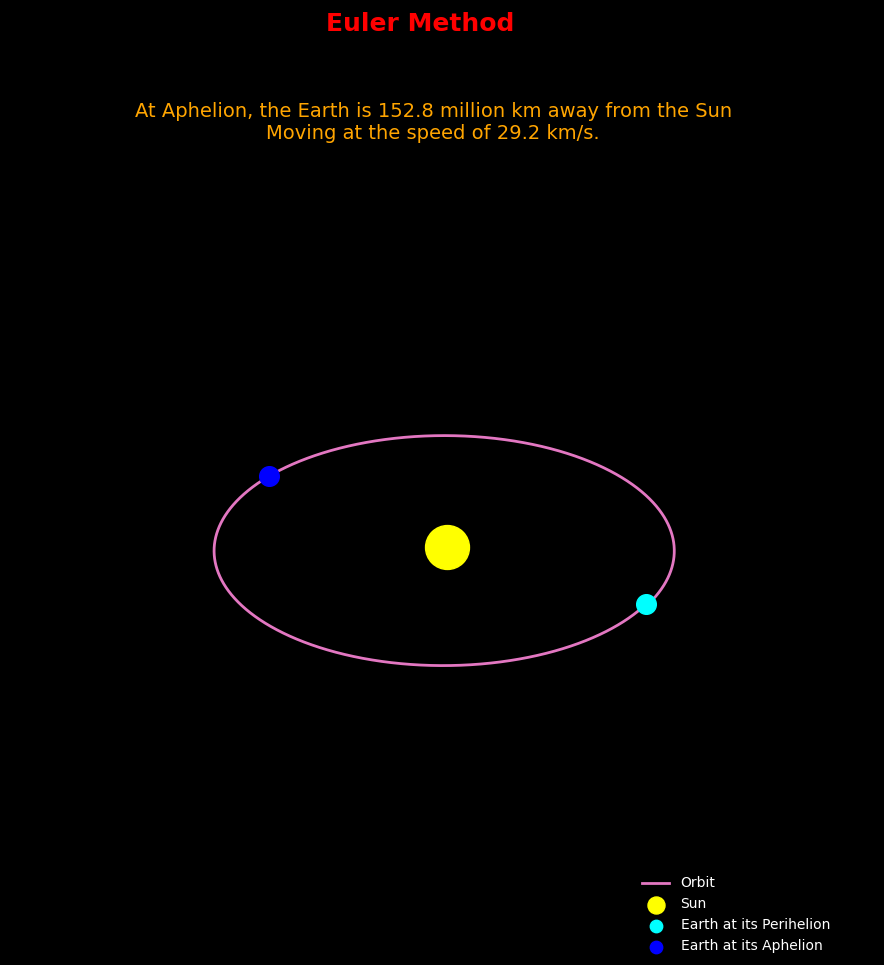
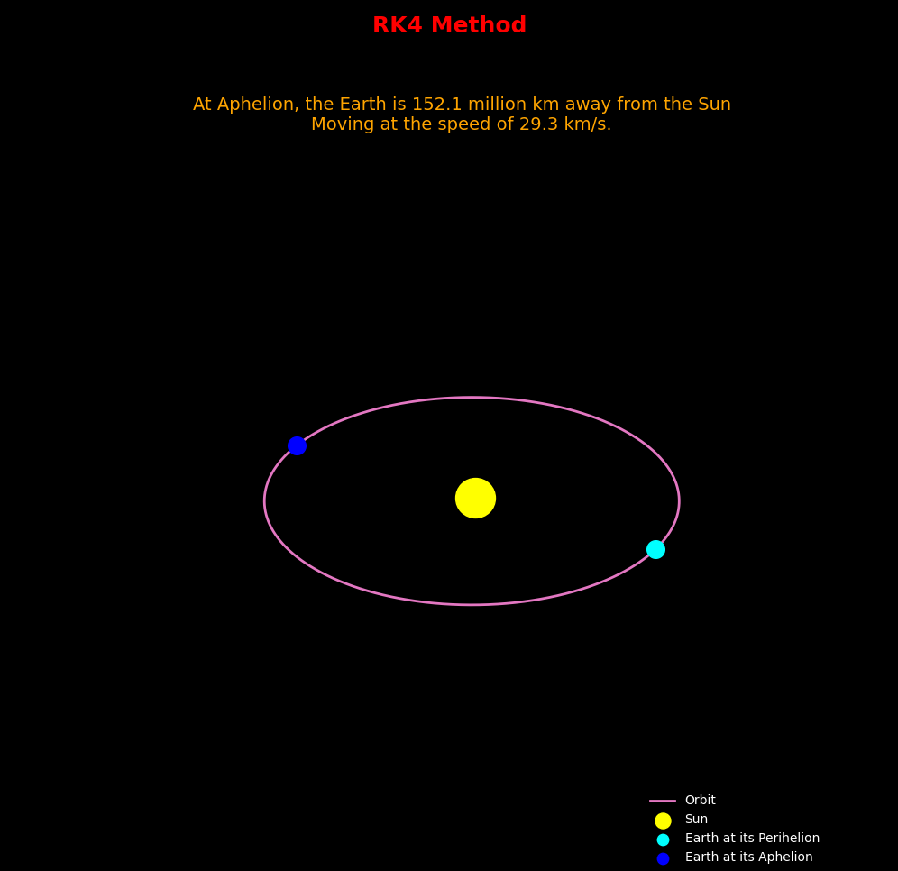
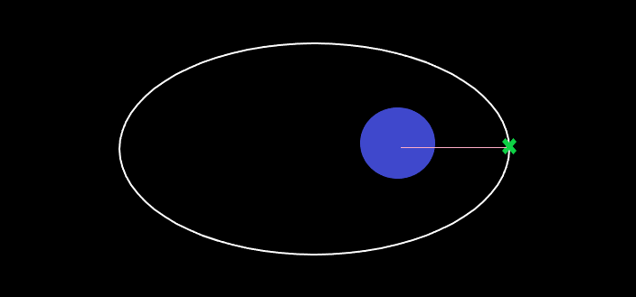
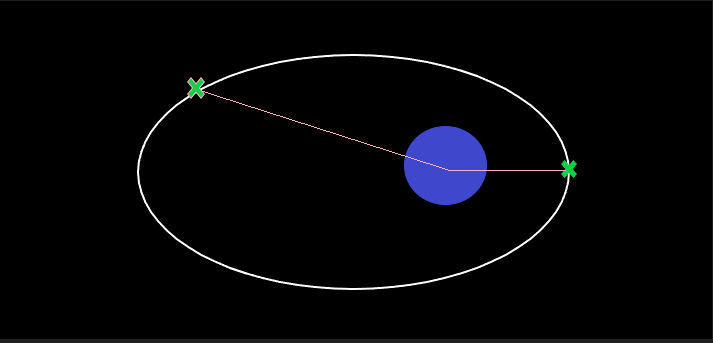

# 🛰️ Python for Space Applications – Course Repository

Welcome to my personal repository for the **"Python for Space Applications"** course powered by Udemy Academy. You can find the course at the following link:   [**Python for Space Applications (Udemy)**](https://www.udemy.com/course/python-for-space-applications-git-fastapi-machine-learning/?couponCode=ACCAGE0923)

The course combines core Python programming with fascinating space-related simulations and real-world applications like deploying machine learning models as APIs. 
During the course, the theory is first covered rigorously, followed by practical exercises to apply the concepts learned.
This repo contains my implementations, exercises, and notes from the course.

---

### 🎯 Course Objectives

The main goals of the course are to:

- Simulate real celestial mechanics such as Earth’s orbit and solar system dynamics.
- Use Python libraries like **NumPy** and **Matplotlib** for data manipulation and visualization.
- Solve classic space problems such as **Kepler’s Equation** using numerical methods.
- Deploy a **Machine Learning** model through an API using **FastAPI**, for integration in space-related systems.

---

### What's Inside

The first four modules of the course focused on fundamental Python concepts such as data types, control flow, functions, and object-oriented programming (OOP). These topics were mostly review for me, as I already had a solid background in Python.

A notable exercise is found in the notebook `BuildRocket.ipynb` (under the `code` directory -> `M3 - Build a Rocket using OOP`), where we define a simple `Rocket` class to practice OOP principles. The notebook introduces concepts step by step: from creating a basic class and instantiating objects, to adding methods for movement and computing distances between rockets. Although the logic is simple, the goal was to reinforce familiarity with classes, constructors, attributes, and methods in a space-themed context.


## 🌍 M5 - Earth's orbit around the sun

This module simulates the Earth's orbit around the Sun over one year using two numerical integration methods: **Euler's Method** and the **4th Order Runge-Kutta (RK4)** Method. It also computes the Earth's distance and speed at **aphelion** (the point where the Earth is farthest from the Sun) and compares the results for both methods. For further information please refer to the README inside the M5 folder.


- `earth.py`: This module simulates the orbit of the Earth around the Sun for one full year using numerical methods. It compares the **Euler method** and the **4th-order Runge-Kutta (RK4)** method to estimate the Earth’s position, velocity, and distance from the Sun at aphelion (the farthest point from the Sun).


### Problem Statement

- Simulate the Earth's orbit around the Sun for one year.
- Implement both **Euler** and **RK4** methods to solve the equations of motion.
- Compute the distance from Earth to the Sun at **aphelion** and compare results between methods.
- Visualize the trajectory in a 2D/3D plot.


### Physics Background

The gravitational acceleration acting on Earth due to the Sun is given by:

 → $a = -\frac{GM}{|r|^3}\times\vec{r}$

Where:
- G is the gravitational constant.
- M is the mass of the Sun.
- r is the position vector from the Earth to the Sun.

Equations to integrate:
- Position:  → $\frac{dr}{dt} = v$
- Velocity:  → $\frac{dv}{dt} = a$

Initial Condition: Earth is at its Perihelion (closest to Sun)

### Implementation

- **Initial Conditions**:
  - Earth starts at **perihelion** (closest point to the Sun).
  - Realistic values for Earth’s initial position and velocity are used.

- **Integration Methods**:
  - **Euler Method**: Simple, less accurate.
  - **RK4 Method**: More accurate and stable over long simulations.

- **Simulation Parameters**:
  - Time step: 1 hour
  - Total duration: 1 year

By changing the config.json file it is possible to run the simulation for any planet of your choice.

You can run the code through the main.py module.
### Output

- The simulation computes:
  - The Earth’s full trajectory.
  - The distance and speed at **aphelion**.
- A plot is generated showing:
  - Earth's orbit.
  - Position of the Sun.
  - Annotations for perihelion and aphelion.






---

## ☀️ M6 - Solar System Simulation with Pygame

This module provides a real-time **2D simulation** of the Solar System using **Newtonian gravity**, rendered with **Pygame**. It includes dynamic visualization of planetary motion, orbital trails, distance indicators, and interactive controls like pausing the simulation or toggling orbit visibility.

The simulator can be customized to simulate various planetary systems by modifying initial conditions and system parameters.


### Module Overview

- `main.py`: Entry point of the simulation. Initializes the Pygame window and runs the simulation loop.
- `simulation.py`: Manages updates and rendering of celestial bodies, trails, distances, and labels.
- `solar_system.py`: Contains the `SolarSystemBody` class, which simulates physical behavior using Newton's Law of Gravitation.
- `stars.py`: Generates a random background of static stars to enhance visual depth.
- `parameters.py`: Stores adjustable constants like scale, gravitational constant, and simulation time step.
- `colors.py`: Defines a consistent color scheme for rendering different celestial bodies and labels.

### Problem Statement

- Simulate planetary motion governed by Newtonian gravity.
- Create a visual and interactive 2D representation of a solar system.
- Track and display real-time distances from each planet to the central star.
- Include optional visual features such as orbit trails and starry backgrounds.


### Physics Background

The gravitational force acting on a planet due to the Sun is given by:

$$
\vec{F} = G \cdot \frac{m_1 \cdot m_2}{r^2} \cdot \hat{r}
$$

This results in the following acceleration:

$$
\vec{a} = -G \cdot \frac{M}{|\vec{r}|^3} \cdot \vec{r}
$$

Where:
- G is the gravitational constant.
- m₁, m₂ are the interacting masses (e.g. Sun and planet).
- **r** is the position vector from the Sun to the planet.
- **r̂** is the unit vector in the direction of **r**.


Each body's velocity and position are updated using **Euler integration** at each time step.


### Implementation

- **Object-Oriented Design**:
  - Each celestial object is a `SolarSystemBody` with mass, radius, position, and velocity.
- **Euler Integration**:
  - Simple, fast numerical integration for updating positions and velocities.
- **Orbital Trails**:
  - Each body records its trajectory to draw persistent orbit paths.
- **Interactive Controls**:
  - Toggle trails: `T`
  - Pause simulation: `Space`
  - Show/hide distance text: `D`


By editing `parameters.py` and initial body setups, you can simulate:
- Fictional planetary systems.
- Binary stars or exoplanets.
- Real-world planet data.

You can run the code through the main.py module.

### Output

The output of the simulation consists of:
- A visual representation of the stars drawn on a Pygame window.
- Each star is represented as a small circle with a randomly chosen position, brightness (color), and size.


<video controls src="ss_simul.mp4" title="Title"></video>
---

## 🌕 M7 - Solving Kepler's equation

This module predicts the **position** and **velocity** of a satellite orbiting the Earth exactly **4 hours after it passes the periapsis**. Using orbital mechanics principles and solving **Kepler’s Equation numerically**, the script estimates the satellite's **true anomaly**, **distance** from Earth, and **velocity** at that point.


### Problem Statement

Given the orbital elements of a satellite, determine its position and velocity **4 hours after** passing the **periapsis** (closest point to Earth in the orbit).




### Physics background

The computation follows these steps:

1. **Mean Anomaly (M)** from time using:

   $$
   M = n t \quad \text{where} \quad n = \sqrt{\frac{\mu}{a^3}}
   $$

   Here, $\mu = GM$ is the gravitational parameter for Earth.

2. **Eccentric Anomaly (E)** using **Kepler’s Equation** (solved with **Newton-Raphson method**):

   $$
   M = E - e \sin E
   $$

3. **True Anomaly (f)** from E using:

   $$
   \tan{\frac{f}{2}} = \sqrt{\frac{1+e}{1-e}} \tan{\frac{E}{2}}
   $$

4. **Position (r)** at that point using:

   $$
   r = \frac{a(1 - e^2)}{1 + e \cos f}
   $$

5. **Velocity (v)** at that point using the **Vis-Viva equation**:

   $$
   v = \sqrt{\mu \left( \frac{2}{r} - \frac{1}{a} \right)}
   $$


### Implementation

- `m7_satellite_position.py`: This script computes the state (position and velocity) of a satellite in an elliptical orbit around Earth after a fixed time interval since periapsis, using orbital parameters and Newton-Raphson's method to solve Kepler’s Equation.


*Given Parameters :*
```
Semi-major axis:       25,512 km
Eccentricity:          0.625
Initial true anomaly:  0 rad
Time since periapsis:  4 hours
```

### Output

After running the simulation, the following results are printed:

- **True Anomaly** (in radians)
- **Distance** from Earth (in km)
- **Velocity** of the satellite (in km/s)

These outputs give a snapshot of where the satellite is and how fast it is moving exactly **4 hours after periapsis**.


The satellite’s estimated position is represented in a plotted orbit (if visualization is added), showing where it lies relative to Earth after the 4-hour interval.



---

## 🤖 M8 - Introduction to Machine Learning

This module introduces the fundamentals of **Machine Learning** with a focus on **Linear Regression**. It covers the process of preparing data, training a model, and evaluating its performance using regression metrics.

### Problem Statement

- Understand the relationship between independent (features) and dependent variables (targets).
- Implement a Linear Regression model to find the best-fit line for a given dataset.
- Evaluate the model using metrics like Mean Squared Error (MSE) and R-squared.

### Machine Learning Background

Linear Regression aims to model the relationship between a scalar response $y$ and one or more explanatory variables $X$ using a linear equation:

$$
y = \beta_0 + \beta_1 x + \epsilon
$$

Where:
- $\beta_0$ is the intercept.
- $\beta_1$ is the slope (weight).
- $\epsilon$ is the error term.

### Implementation

- `Linear_Regression.ipynb`: Jupyter notebook demonstrating data generation, feature scaling, model training with `scikit-learn`, and results visualization.

### Output

- Correlation analysis between variables.
- Visual representation of the regression line against the data points.
- Model performance summary (Coefficients, Intercept, MSE).

---

## 🚀 M9 - Deploy ML model as API using FastAPI

This module demonstrates how to take a trained Machine Learning model and deploy it as a functional web service. The project focuses on a **Star Type Classification** system.

### Problem Statement

- Build a robust API to serve predictions for star classifications.
- Classify stars into categories: **Red Dwarf, Brown Dwarf, White Dwarf, Main Sequence, Supergiant, Hypergiant**.
- Ensure data validation and high performance for real-time inference.

### Technical Stack

- **FastAPI**: Modern web framework for building APIs.
- **Scikit-Learn**: Framework used for the Machine Learning pipeline.
- **Pydantic**: Data validation and structure.
- **Uvicorn**: ASGI server to run the application.

### Implementation

- `star_tipe_prediction.ipynb`: A comprehensive Jupyter notebook that serves as the research and development phase. It includes:
  - **Data Exploration**: Analyzing the star dataset (temperature, luminosity, etc.).
  - **Preprocessing**: Feature scaling using `StandardScaler`.
  - **Model Training**: Implementing a `LogisticRegression` classifier within a `Pipeline`.
  - **Model Export**: Saving the final pipeline as `pipeline.pkl` for deployment.
- `api.py`: The entry point that defines the FastAPI routes and prediction logic.
- `predictor.py`: Contains helper functions to load the model and make predictions.
- `star_data.py`: Defines the data models using Pydantic for input/output validation.
- `pipeline.pkl`: The serialized pre-trained classification model.

### Output

- A RESTful endpoint `/predict` that accepts physical properties of a star (Temperature, Luminosity, Radius, Absolute Magnitude).
- JSON responses containing:
  - **Predicted Class**.
  - **Probability Distribution** across all star types.
  - **Confidence Score**.
- Auto-generated documentation available via Swagger UI (`/docs`).
